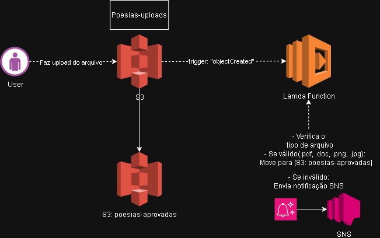

# Projeto: Website de Poesias Automatizado com AWS Lambda e S3
O repositório tem como objetivo consolidar os meus conhecimentos em tarefas automatizadas com Lambda Function e S3.

## Sobre
- Para esse projeto eu quis usar um exemplo criativo e real para automatizar o processo de envio e armazenamento de poesias, textos e imagens poéticas enviados pelos usuários dentro de um WebSite. Para isso, é utilizada a integração entre os serviços Amazon S3 e AWS Lambda, que permite que os arquivos sejam **validados e processados automaticamente**.

- Exemplo de fluxograma de arquitetura: 

### Explicação:
1. **Upload do Arquivo**  
O usuário acessa o site e envia seu arquivo (poesia, texto ou imagem).
Esse arquivo é enviado diretamente para um bucket do **Amazon S3**, chamado poesias-uploads, que serve como área temporária para os arquivos recebidos.
2. **Disparo do Evento no S3**  
Sempre que um novo arquivo é salvo, o S3 gera automaticamente um evento do tipo ObjectCreated.
Esse evento aciona a função Lambda, que é responsável por processar o arquivo.
3. **Validação Automática no AWS Lambda**  
A função **AWS Lambda** é executada automaticamente e faz a verificação do tipo de arquivo.
> São aceitos apenas os formatos:
.pdf, .docx, .png e .jpg.

->Se o arquivo for válido, ele é movido para outro bucket, chamado poesias-aprovadas. 
-> Se o arquivo for inválido, o Lambda pode movê-lo para o bucket poesias-rejeitadas ou enviar uma notificação via **SNS (Simple Notification Service)** para informar o administrador sobre o erro. 
4. **Armazenamento e Exibição** 
Os arquivos aprovados ficam armazenados no S3 de destino e podem ser exibidos no website hospedado em um Web Site hospedado em uma  instância EC2 ou página estática do próprio S3, permitindo que visitantes leiam ou baixem as poesias.

### Conclusão
- Esse projeto demonstra como a integração entre o **AWS Lambda e o Amazon S3** pode ser aplicada em situações práticas e criativas, como nesse website de poesias.
A automação garante eficiência, organização e segurança no armazenamento dos arquivos, evitando erros humanos atráves da automatização desses processos. Além de exemplificar o potencial das funções serverless na computação em nuvem.

#### Referências 
[Documentação oficial da AWS](https://docs.aws.amazon.com/pt_br/AmazonS3/latest/userguide/olap-using-cfn-template.html) 
[Aula + projeto do curso](http://hermes.dio.me/files/assets/36d9c1fc-b2b4-4af7-9bc5-2240f06fddfb.zip)
